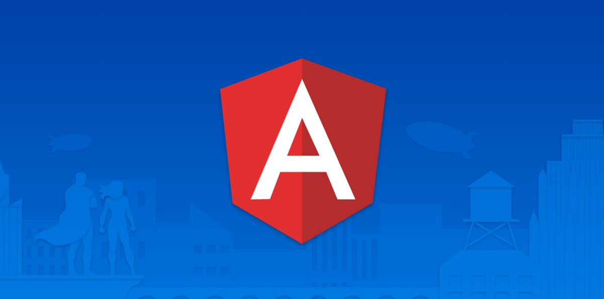

# Observáveis em Angular!

<p align="center">
    
  <p align="center">
     Sumário
      <p align="center">
        <a href="#sobre"> Sobre </a> |
        <a href="#o-que-são-observáveis"> O que são observáveis? </a> |
        <a href="#observações-sobre-subscribe"> Observações sobre subscribe() </a> |
        <a href="#como-criar-um-observável"> Como criar um observável </a> |
        <a href="#observações"> Observações </a> |
        <a href="#conclusão"> Conclusão </a>       
       <br />
        <br />
     <h1 align="center"></h1>
    </p>
</p>

This project was generated with [Angular CLI](https://github.com/angular/angular-cli) version 14.2.7.

## Sobre
Este repositório foi criado com o objetivo de fazer um código simples e de fácil entendimento para junto a documentação, ajudar mais pessoas entenderem o conceito de observáveis em Angular.

## O que são observáveis?
<p>Primeiro, é muito importante entender que sempre existe um observável (algo a ser observado) e um observador (o que observa algo). Sendo assim, um observável consiste em um objeto Angular ou que pode ser importado de um pacote de terceiros, nesse repositório, foi utilizado o RXJS. Além disso pode ser pensado como uma fonte de dados, que com a ajuda de um observador, irá observar o retorno, ou execução de uma tarefa assíncrona, ou a execução de código/evento que pode acontecer após a interação do usuário, por exemplo, e com base nisso o observável passa pelo observador e então, é possível executar algum código.</p>

<p>Tendo em vista, que sempre há um observável, observador e, entre eles, um fluxo de código, pode-se pensar que, se tratando de observáveis Angular, o método subscribe() é um observador. Veja no exemplo de código abaixo:</p>


```html
   <a [routerLink]="['user', 1]">
        User 1
    </a>
      |
    <a [routerLink]="['user', 2]">
        User 2
    </a>
```

```javascript
    ngOnInit() {
        this.route.params.subscribe((params: Params) => {
        this.id = +params.id;
        });
    }
```

<p>Neste exemplo, quando o usuário clica em um dos links ele passa para rota 'user' o id do usuário clicado, mas é o método subscribe() que fica observando a mudança desses id's, para que com base nisso, possa alterar a propriedade que mostra o id no componente 'app-user'.</p> 
<p>Portanto, os observáveis também podem ser pensados como construções, que assinamos/inscrevemos para sermos informados sobre mudanças que acontecem após a execução de algum código que está sendo observado. Nesse caso, a mudança do parametro da rota após o clique do usuário.</p>

## Um outro exemplo

```javascript
    import { interval, Subscription} from 'rxjs';

    ngOnInit() {
        this.firstSubscription = interval(1000).subscribe(count => {
            console.log(count)
        })
    }
```

<p>Neste exemplo, foi importado um observável do pacote RXJS, que incrementa um valor a cada segundo, e o observador -> subscribe() observa isso e mostra no console. Mas tem algumas coisas que são mutio importantes sobre os observáveis e é preciso estar ciente:</p> 

<p>1 - Neste trecho de código por exemplo, o observável não deixa de emitir os intervalos após a rota/componente ser deixado/após o usuário navegar para outra rota da aplicação.</p>

<p>2 - Podem ter observáveis que irão emitir um valor uma única vez, como por exemplo, observáveis para requisições HTTTP.</p>

<p>3 - Quando for utilizado observáveis como o do exemplo acima, emitindo dados após a execução de algum código ou a inicializacao de um componente, para que o observável pare e deixe de emitir novos valores após o componente/rota ser deixado, é necessário cancelar o método subscribe()/o que ele está retornando, e isso deve ser feito dentro do método ngOnDestroy, que é executado no momento/ciclo de vida da destruição do componente.</p>

```javascript
    ngOnDestroy(): void {
        this.firstSubscription.unsubscribe();
    }
```

<p>Dessa maneira, ao deixar a rota/componente, deixa de ser executado todo e qualquer dado observável e retorno do subscribe(). No entando, note, que isso só é possível quando armazenado tudo o que é retornado pelo subscribe() em alguma propriedade no componente.</p>

```typescript
    private firstSubscription: Subscription;
```

<p>Talvez, você esteja se perguntando agora: "Porque no primeiro exemplo, não foi necessário cancelar o subscribe()?"</p>

<p> 1 - Aquele observável só retornava algo/informava ao componente alguma mudança após o usuário clicar em algum link.</p>

<p> 2 - Porque <strong>os observáveis Angular são gerenciados pelo Angular, portanto, isso inclui o cancelamento/unsubscribe() do observável, sem a necessidade de faze-lo manualmente.</strong><p>

## Observações sobre o subscribe()

<p> No exemplos acima, podemos ver que o método subscribe() está sendo chamado através de diferentes observáveis, sendo informado sobre algumas mudanças e, executando algum código com base nisso. Mas o subscribe() pode receber até 3 parametros, que podem ser entendidos como diferentes maneiras de lidar com o que é observado e posteriormente informado. Veja no exemplo abaixo: </p>

```javascript
    subscribe(
      valor => {
        // code
      },
      erro => {
        //code
      },
      conclusao => {
        // code
      });
```

<p> Sendo assim, o subscribe() pode executar diferentes códigos p/ cada fase do observável: retorno dados, erro nos dados ou a conclusão do observável.</p>

## Como criar um observável

<p> O Angular tem muitos observáveis e utiliza do método subscribe() como forma de observar as mudanças/retornos após algum fluxo de código ser executado dentro do observável. No entanto, também é possível, criar os seus próprios observáveis. Vamos fazer isso aqui para entendermos melhor observável e observador!</p>

<p> Primeiro é preciso importar o observável e também a Subscription do pacote RXJS:</p>

```javascript
    import { Subscription, Observable } from 'rxjs';
```
<p> Em segundo, é necessário instanciar este objeto e definir o tipo do observável:<p>

```typescript
   const customObservable = new Observable<number>()
```
<p>Em terceiro, é necessário definir o que vai ser informado ao seu observador a partir do observável. Isso é feito através de uma arrow function, inserida no parametro do observável, a qual recebe como parametro um observador:</p>

```javascript
    const customObservable = new Observable<number>((observator) => { <------- arrow function que recebe o observador
      let count = 0;
        setInterval(() => {
            observator.next(count); <------ método do observador
            count++;

            if(count === 3) {
            observator.complete() <------ método do observador
            }

            if (count > 7) {
            observator.error(new Error("Maior que 7!")) <------ método do observador
            }
        }, 1000);
    });
```

<p> Perceba que através dos métodos do observador, conseguimos informar quando o nosso observável está lidando com novos dados, quando ele pode ser completado/concluído e quando ele deve apresentar algum erro.</p>

<p> No exemplo acima, nosso observável está lidando com os números que são contados a cada intervalo. Quando o contador chega em 3, o observável é concluído e informa isso ao observador, se ele passar de 7, o que nesse caso não tem como acontecer, mas só a nível de exemplo mesmo, ele informaria um erro ao observador.</p>

<p> Mas e agora? <strong>Como o observador pode mostrar esses dados observáveis e informar algo, ou executar algo que gere alguma mudança na aplicação?</strong> Nós podemos usar o método <strong>SUBSCRIBE()!!</strong> Veja um exemplo de código abaixo:</p>

```javascript
    this.firstSubscription = customObservable.subscribe((count) => {
        console.log(count); <------ mostra no console cada numero contado emitido pelo observável e informado ao observador.
    }, (error)=> {  
        alert(error.message) <------- emite um alert com o mensagem de erro definida e informada ao observador, no observável.
    }, ()=> {
       alert("Observável concluído!") <------ emite um alert quando o valor contado pelo observável é 3 e é informado ao observador como concluído.
    });
```

<p> Observe que quando um observável é utilizado dessa maneira, de um jeito 'customizado'/quando você cria o seu próprio observável, é possível definir quando ele está gerando novos dados, quando ele pode emitir um erro e quando ele pode ser concluído.</p><strong>Mas quando utilizamos observáveis do Angular</strong>, isso é definido pelo Angular. O que podemos fazer é criar códigos, reagir ou atés mesmo acessar as informações observadas nesses diferentes momentos de um observável, com o método subscribe().</p>

## Observações
<p>Quando um observável é concluído ele não retorna, nem informa mais nada ao observador. No entanto isso é diferente de quando ele informa ao observador sobre um erro. Mas em ambos os casos, na conclusão ou no erro de um observável, é desnecessário cancelar o subscribe() como informado anteriormente, pois eles não emitem novos valores. Isso só deve ser implementado nos casos em que um observável antes de ser concluído ou antes do erro, puder emitir dados de maneira constante e, antes dos referidos momentos, o componente ou rota puder ser deixado e o observável não for um observável Angular.</p>

## Conclusão
<p> Pode ser que você tenha olhado os exemplos acima, e até mesmo o código nesse repositório e pensado: "Para que eu usaria esse código?"</p>
<p>E a resposta é que muito provavelmente você não precise utilizá-lo para algum fim muito específico, mas ideia aqui é entender o que são os observáveis e o que acontece dentro deles. Raramente você irá precisar construir os seus próprios observáveis, geralmente utilizamos os de bibliotecas ou do próprio Angular, mas ainda assim é muito importante entender como eles funcionam.</p>

Sinta-se a vontade para explorar todo seu conhecimento utilizando este projeto, qualquer dúvida ou sugestão me procure no <a href='www.linkedin.com/in/cibelemartinssss'>Linkedin</a>.
